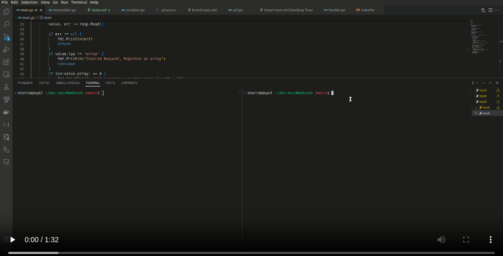

2# MemStash: Redis-Like Server Documentation

This documentation provides an overview of MemStash, a Redis-like server implemented in Go. MemStash supports a variety of common Redis commands, offers serialization and deserialization of data in the Redis Serialization Protocol (RESP) format, and includes persistent logging of executed commands in an Append-Only File (AOF). Additionally, it emphasizes future plans for further development, including the addition of commands and a testing section.

## Extended Redis Commands Support

MemStash currently supports the following common Redis commands:
| Basic Commands       | Hash Commands           |**Multi SET and Multi GET:** |    
|-----------------------|-------------------------|-------------------------|
| PING                  | HSET                    | mset                  |
| SET                   | HGET                    |mget                  |       
| GET                   | HGETALL                 |
| DEL                   |                         |
|                       |                         |

## Project Structure Summary

### `main.go`

- Main server entry point.
- Listens on port 6379.
- Handles basic Redis commands and logs data in an Append-Only File (AOF).

### `deserializer.go`

- Converts RESP format to Go data structures.
- Supports types: string, error, integer, bulk, array.

### `serializer.go`

- Converts Go data structures to RESP format.
- Supports types: string, error, integer, bulk, array, null.

### `handler.go`

- Defines handlers for Redis-like commands.
- Handles PING, SET, GET, DEL, HSET, HGET, HGETALL.
- Utilizes in-memory structures and mutexes for thread safety.

### `aof.go`

- Implements Append-Only File (AOF) for persistent command logging.
- Uses buffered reader and file pointer.
- Periodically syncs AOF file with storage (`dump.aof` file).

## GitHub Actions

This project leverages GitHub Actions to automate the synchronization of multiple branches streamlining the development process.

To explore the GitHub Actions workflow configuration, check the `.github/workflows` directory in the repository.

## Video Walkthrough

## Execution

1. **Starting MemStash:**
   - Run MemStash by executing `make run` and it will run all the go files .

## Conclusion

**MemStash**, the Redis-like server, provides an extended set of common Redis commands and serves as a foundation for future development. The addition of comments and a testing section will contribute to MemStash's maintainability and robustness. Over the upcoming weeks, the project will undergo continuous development, including the implementation of additional commands, comprehensive testing, and the addition of new features. 
